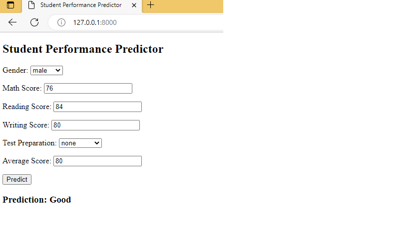

# Student Performance Predictor (Django + Machine Learning)

 

## Overview

This project demonstrates how to **build, train, and deploy a Machine Learning model** that predicts a student's performance category (e.g., **Poor, Average, Excellent**) based on:

- Gender  
- Test Preparation Course (Completed/None)  
- Math, Reading, and Writing Scores  

The project is implemented using **Python, Scikit-learn, and Django**, showing the full ML-to-web-app pipeline.

---

## Why This Project Matters

At first glance, the web app may seem simple — you input scores, and it predicts "Excellent" for high scores.  
However, this project highlights several **key Machine Learning and deployment concepts**:

1. **Real ML Model (Logistic Regression)**  
   - The model learns **weights** for each feature (gender, test prep, scores) based on the training dataset.  
   - Predictions aren’t just simple `if average > 70` rules — the model generalizes from patterns in data.

2. **End-to-End ML Pipeline**  
   - Data preprocessing (label encoding, feature engineering).  
   - Model training, saving (`.pkl`), and loading.  
   - Integration with a Django web app to make live predictions.

3. **Foundation for Real Applications**  
   - Schools could extend this tool by adding more features (attendance, study hours, demographics) to **identify at-risk students** and **provide early interventions**.  
   - The structure scales easily to more advanced ML models (Random Forest, Gradient Boosting).

---

## Features

- User-friendly form for inputting student data.
- Real-time performance prediction using a **trained Logistic Regression model**.
- Encodes categorical variables (gender, test preparation) behind the scenes.
- Displays results dynamically (can be expanded into visual dashboards).

---

## Tech Stack

- **Backend:** Django (Python web framework)  
- **Machine Learning:** Scikit-learn (Logistic Regression)  
- **Frontend:** HTML5, CSS, Bootstrap (customizable)  
- **Data Handling:** Pandas, NumPy  
- **Model Persistence:** `joblib` for saving/loading models

---

## Screenshots

### Main Prediction Form


### Prediction Result


*(Place your actual screenshots inside the `images/` folder in your repo.)*

---

## Project Structure

```
student_performance_project/
├── predictor/
│   ├── ml_models/               # Saved model and encoders (.pkl files)
│   ├── templates/predictor/     # form.html and result.html
│   ├── forms.py
│   ├── predictor_utils.py       # ML preprocessing and prediction logic
│   ├── views.py                 # Handles web requests and predictions
│   └── urls.py
├── student_performance_project/
│   ├── settings.py
│   ├── urls.py
├── manage.py
├── requirements.txt
└── README.md
```

---

## Setup Instructions

1. Clone the repository:
   ```bash
   git clone https://github.com/yourusername/student-performance-predictor.git
   cd student-performance-predictor
   ```

2. Create and activate a virtual environment:
   ```bash
   python -m venv venv
   source venv/bin/activate  # On Windows: venv\Scripts\activate
   ```

3. Install dependencies:
   ```bash
   pip install -r requirements.txt
   ```

4. Run the Django server:
   ```bash
   python manage.py runserver
   ```

5. Open the app in your browser:
   ```
   http://127.0.0.1:8000/
   ```

---

## Future Improvements

- Replace Logistic Regression with **Random Forest or Gradient Boosting** for higher accuracy.
- Add visualizations (e.g., feature importance charts, risk dashboards).
- Allow **batch predictions** by uploading CSV files.
- Deploy to **Heroku, Render, or PythonAnywhere** for live usage.

---

## License

MIT License — Free to use and modify.
